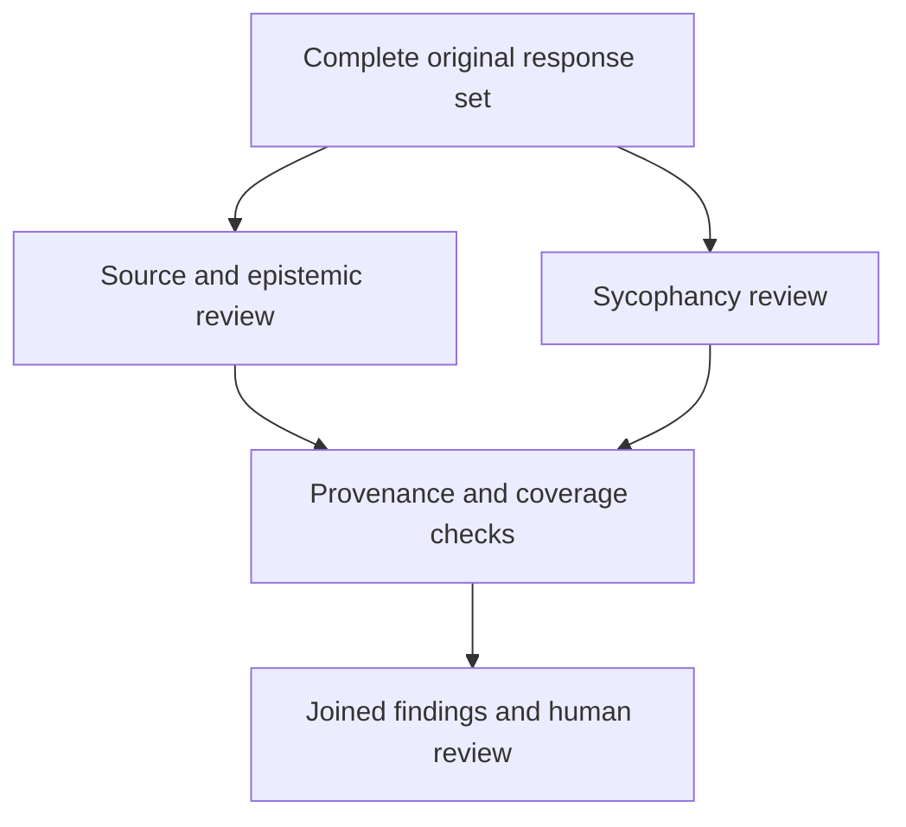

# AnyKey Document Checker

### Keep the evidence. Keep the disagreement. See what survives review.

An experimental method for examining AI responses without mistaking confidence, agreement, or a compelling story for evidence. Built by Darren Russell with AI collaboration at **[AnyKey Cafe](https://anykeycafe.com/)**, an independent home-based laboratory and public notebook.

**[Read the proposal](PROPOSAL.md) · [Try the working kit](WORKING-KIT.md) · [Support the next stage](SUPPORT.md) · [Explore the wider lab](PROJECTS.md)**

## What changed

The earlier plan sent a document through three AI reviewers and added an epistemological check afterward. During design discussions with Darren and Codex, Claude proposed separating the checks so that one could not filter what the other saw. We adopted that direction.

Both reviewers now receive the **complete original response set** in separate contexts. One examines source support and epistemic treatment; the other examines sycophancy—whether an assistant bends its analysis toward pleasing the user. Their complete verdicts meet only after both reviews finish.

The aim is to preserve cases that a sequential filter could hide: for example, an answer that sounds sober and independent but has no adequate factual support.

## What you can inspect today

| Material | What it provides |
| --- | --- |
| [Revised proposal](PROPOSAL.md) | Why the process changed, its boundaries, and the next evaluation steps |
| [Python working kit](parallel-document-checker-0.1.0.zip) | Input preparation, separate reviewer prompts, provenance checks, and a deterministic join |
| [Synthetic tests](parallel-document-checker-0.1.0.zip) | Checks of the preparation and join machinery |
| [TEVV status](TEVV-REPORT.md) | What has been tested and what has not |
| [Public tools library](https://anykeycafe.com/prompts-and-scripts/) | The website explanation and related methods |

**Status: runnable experimental foundation, version 0.1.0.** Four local tests passed on September 11, 2026. This checks software behavior; it does not establish evaluator accuracy, reviewer independence, or superiority over the earlier method. Human-labeled evaluation and live model comparisons remain ahead.

## Help turn a proposal into evidence

We are seeking model access or evaluation credits, independent reviewers, suitable test documents, and support for reproducible runs. The next deliverable is an empirical comparison with the earlier sequential approach, with disagreements and failures retained.

See **[support and milestones](SUPPORT.md)** or **[contact Darren](https://anykeycafe.com/contact-contribute/)**. Equipment, hosting, and other lab needs are described in the **[Project Wish List](https://anykeycafe.com/project-wish-list/)**, including the conditions for accepting help.

## Working principles

- Preserve the original record and attach provenance.
- Separate observation, interpretation, and uncertainty.
- Record model versions, prompts, dates, and relevant settings.
- Include failures and disagreements alongside successes.
- Keep human adjudication visible; agreement between models is not proof.

The wider laboratory explores practical human–AI collaboration, memory, and creative tools. Those investigations provide context, not evidence that this checker is validated. [Explore the projects and working demonstrations →](PROJECTS.md)
